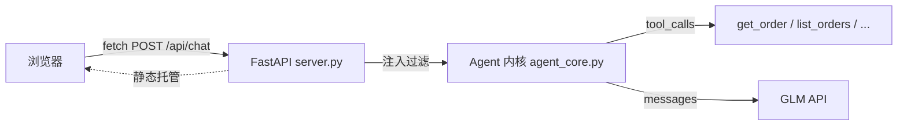

# Ch8 求职冲刺（Day 28）

> **本章关键词**：全部——把 28 天学到的都写进简历
>
> **学完你能做什么**：两份经得起细看的 README、一段 STAR 结构的简历项目描述、一套面试答题框架与完整题库、一份求职期继续学习计划。以及——毕业。

::: info 📋 一天安排
**上午**：资产盘点 + README 最后打磨 + 简历项目描述 · **下午**：面试题库过一遍 + 制定求职期计划
:::

## 1. 资产盘点：你手里有什么

28 天前你零基础。现在盘点一下（缺哪项今天就补）：

| 资产 | 在哪 | 求职时怎么用 |
| --- | --- | --- |
| 两个公网可访问的项目 | `IP:8501`（RAG 问答）/ `IP:8000`（Agent 客服） | 简历放链接，面试官现场点开 |
| 项目源码仓库 | GitHub，含架构图/评估数据/Docker | 被深挖时的底气 |
| 技能集 | 对照下表 | 简历关键词、面试自我介绍 |
| 错题本 | 你的笔记 | 「踩坑经验」类问题的弹药 |

**28 天技能 → JD 用语对照**（写简历时对齐招聘方的词）：

| 你做过的 | JD 里的词 |
| --- | --- |
| GLM API 调用、JSON mode、Pydantic、few-shot、温度调参 | Prompt Engineering、结构化输出、大模型 API 应用 |
| 切分/向量化/Chroma 检索/引用回答/拒答 | RAG、Embedding、知识库建设、幻觉处理 |
| 测试集 + LLM as judge + 参数对比 | LLM 应用效果评估（Ragas 同理） |
| 手写 Agent Loop、4 工具、链式调用 | Function Calling、Agent 开发 |
| 滑动窗口+摘要压缩记忆、session 隔离 | 多轮对话、上下文管理 |
| 注入三板斧（过滤/隔离/最小权限） | LLM 应用安全、Prompt Injection 防御 |
| FastAPI + 原生 JS 前端 + fetch | 前后端分离、FastAPI、RESTful |
| Streamlit write_stream / SSE 方案 | 流式输出 |
| SSH/Linux 排错/nohup 日志 | 熟悉 Linux 环境 |
| Dockerfile/compose/层缓存/镜像搬运 | Docker、容器化部署 |
| ECS 上线、安全组、域名/HTTPS 概念 | 云服务、工程化上线 |

## 2. README 最后一次打磨

90 秒法则最后一次执行（Ch7 检查单过了，README 是门面）。两个升级动作：

**① 架构图升级为 mermaid**——GitHub 原生渲染，比 ASCII 专业一档，且改起来快。项目 2 示例（直接抄改）：

````

````

**② 补「技术选型理由」表**——把课程里埋过的每个决策回收成「选了什么 / 为什么 / 代价」三列。这张表就是面试被问「为什么」时的答案库：

| 决策点 | 选了什么 | 为什么 | 代价/边界 |
| --- | --- | --- | --- |
| 向量库 | Chroma | pip 即用、本地内嵌、零运维 | 不适合超大规模/分布式 |
| 后端 | FastAPI | 异步、自动文档、Pydantic 校验、生态默认 | — |
| Agent 框架 | 手写 Loop | 逻辑透明、好调试、理解原理 | 多 Agent 编排复杂时上 LangGraph |
| 记忆 | 滑动窗口+摘要 | 零依赖、按轮截断防孤儿消息 | 无持久化（生产换 Redis） |
| 模型 | GLM（OpenAI 兼容） | 国内可用、切换模型只改 base_url | — |

## 3. 简历项目描述：STAR 模板

STAR：**S**ituation 情境 → **T**ask 任务 → **A**ction 行动 → **R**esult 结果（量化）。每条经历都是一句话 STAR。改写模板（**数字换成你真实跑出来的**）：

> **企业知识库问答机器人（RAG）** · 独立开发 · 公网可访问
> 针对企业私有知识问答场景（S），开发基于 RAG 的问答应用（T）：文档滑窗切分（300/50）、GLM embedding 向量化、Chroma 语义检索 top-3、带引用生成；手写 10 条测试问答集 + LLM as judge 评估，据此对比选出 chunk 与 top-k 参数（A）；测试集平均 4.6/5 分，库外问题正确拒答，Docker + 阿里云 ECS 上线（R）。

> **垂直领域 Agent 助手（AI 客服）** · 独立开发 · 公网可访问
> 面向电商客服场景（S），开发前后端分离的 Agent 应用（T）：FastAPI 后端 + 原生 JS 前端；手写 Agent Loop（工具决策与执行分离），实现订单查询/链式工具调用/多轮记忆（滑动窗口+摘要压缩）；实现 Prompt Injection 三层防御（输入过滤/指令数据隔离/工具最小权限）（A）；支持 4 工具与多会话隔离，docker compose 一键部署上线（R）。

**三条红线**：不写没做过的；所有数字必须真实可复现（评估表就是证据）；简历上每个词都可能被问——写了就要能讲三分钟。

## 4. 面试作战：题库与打法

完整题库（40+ 题，含答题要点）在[附录：高频面试题库](/appendix/interview)——**今天全部过一遍，标注「讲不顺」的题，明天起每天开口讲三个**。

**答题方法论**（比背答案重要）：

1. **先结论后展开**：「切分我用的滑窗 300/50」→ 再讲为什么
2. **能画就画**：RAG 流程、Agent Loop，边画边讲——课程让你白板练过的
3. **不会就诚实 + 给思路**：「这个我没实操过，但我的理解是……如果要做我会先……」——诚实+思路 > 硬编
4. **把话题往项目带**：每个理论题都尝试落到你的项目上（问幻觉 → 「我项目里是这么处理的」）

**行为面叙事**（转行必问「为什么/怎么学的」）：把 28 天的方法论讲成故事——「我做了岗位 JD 逆向分析，按高频要求设计学习路径；学 RAG 时不是跟着感觉调参，而是先建测试集用 LLM as judge 评估，用数据选参数」——**评估驱动这四个字，是你和大多数速成者的区别**。

## 5. 求职期继续学习路线

**策略：边投边学，不要等「准备好」**。面试反馈会告诉你缺什么。

| 方向 | 什么时候学 | 入手 |
| --- | --- | --- |
| 微调 LoRA | 想投「模型训练/优化」向岗位时 | [datawhalechina/self-llm](https://github.com/datawhalechina/self-llm) |
| LangGraph | 多步/多 Agent 编排岗，或项目要做复杂工作流时 | [HuggingFace Agents Course](https://huggingface.co/learn/agents-course)（中文版）→ LangGraph 官方教程 |
| 多智能体 | 同上，进阶 | [mlabonne/llm-course](https://github.com/mlabonne/llm-course) 路线图 |
| GraphRAG | 投知识库向岗位、面试被问住时 | 微软 GraphRAG 官方库 + 你 Ch3 的迷你实验已经起步 |
| MCP 深入 | 工具生态/平台向岗位 | [HuggingFace MCP Course](https://huggingface.co/learn/mcp-course) |
| 项目灵感 | 想加第三个项目 | [Shubhamsaboo/awesome-llm-apps](https://github.com/Shubhamsaboo/awesome-llm-apps)、[datawhalechina/llm-universe](https://github.com/datawhalechina/llm-universe) |

## 6. 毕业验收（课程终点清单）

- [ ] 简历含两个 STAR 项目描述，数字真实
- [ ] 两份 README：mermaid 架构图 + 选型理由表 + 评估数据
- [ ] 两个项目公网可访问
- [ ] 面试题库全部过完，「讲不顺」清单已列入每日练习
- [ ] 求职期计划已定（投递节奏 + 学习方向）

## 7. 写在最后

28 天前的问题是「零基础能不能转行」；今天的问题变成了「接下来三个月投多少家」。这门课能给你的都给了：方法、项目、证据、题库。剩下的部分——投出去、被问住、回来补、再投——就是工程师的成长方式了。

**祝上岸。** 🎓
